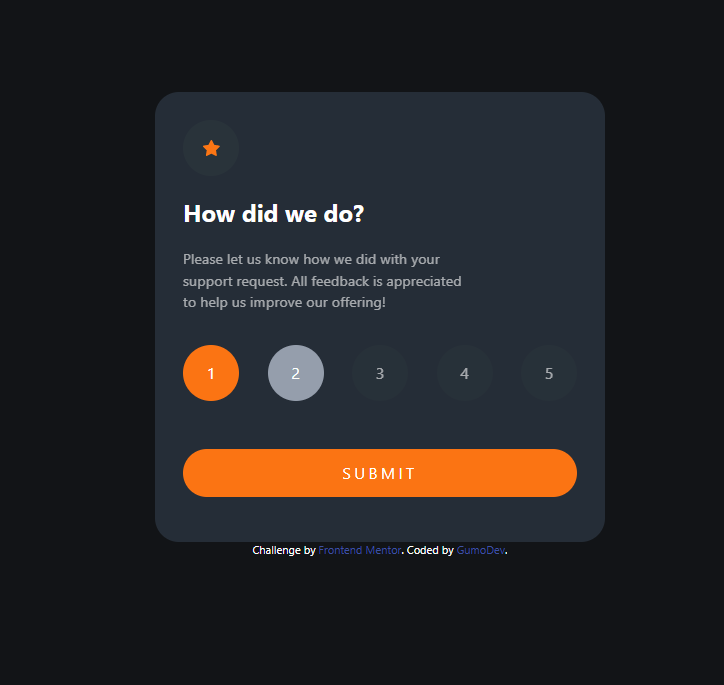

# Frontend Mentor - Interactive Rating Component

This is a solution to the [Interactive Rating Component on Frontend Mentor]. Frontend Mentor challenges help you improve your coding skills by building realistic projects. 

### Links

- Solution URL: [CODE Repo](https://github.com/GumoDev/interactiveratingcomponent)
- Live Site URL: [Live Site Demo](https://gumodev.github.io/productpreviewcardcomponent/)

### Built with

- Semantic HTML5 markup
- Tailwind utility classes
- Flexbox
- Mobile-first workflow
- [VueJs](https://vuejs.org/) - JS library
- [Vite](https://vitejs.dev/) - Web Bundler 
- [Tailwind](https://tailwindcss.com/) - For styles

## Author

- Frontend Mentor - [@gumodev](https://www.frontendmentor.io/profile/gumodev)
